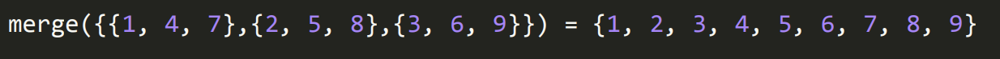

#### Q) Given k sorted arrays, merge them into a single sorted array.

##### e.g.

##### Extension - Try doing this without the .sort() method, explore using your ownsort function (bubble, merge, selection etc)
